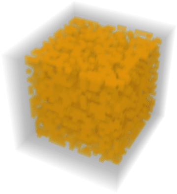

## 2D Cellular Automata: Conways Game of Life (And other patterns)

### What does it use?
- SFML 
- C++
- CMake
### The wikipedia definition of Cellular Automata:
A cellular automaton is a discrete model of computation studied in automata theory. Cellular automata are also called cellular spaces, tessellation automata, homogeneous structures, cellular structures, tessellation structures, and iterative arrays. Cellular automata have found application in various areas, including physics, theoretical biology and microstructure modeling.

Example:

### Purpose of this project:
The main purpose of creating a cellular automata simulation is as follows:
- Learn SFML
- Learn how the simple instructions of Cellular Automata can create incredible simulations as if they are art
- Understand the mathematics of Cellular Automata
- Use this project as a stage 1 project

#### "Stage 1 Project"
This project is the first in a series of 2 projects regarding Cellular Automata. Specifically, this will be made in order to run a 2D simulation of conways game of life (similar to the example above but on a much larger scale and will look a bit more chaotic)

### Plans to take this:

- Stage 2: The big one, and the ultimate goal of this project: 3D Conway's Game of Life constrained within a cube as represented below
- Learn a popular graphics library (Most likely OpenGL or Raylib)
- Purpose: Looks *perfect* on a resume 

Awesome 3D Example:

Goal project completion date: Before 2nd semester of college

Credit for images:
https://mathematica.stackexchange.com/questions/55244/game-of-life-in-3d
http://makeyourownalgorithmicart.blogspot.com/2018/05/artificial-life-and-conways-game-of-life.html